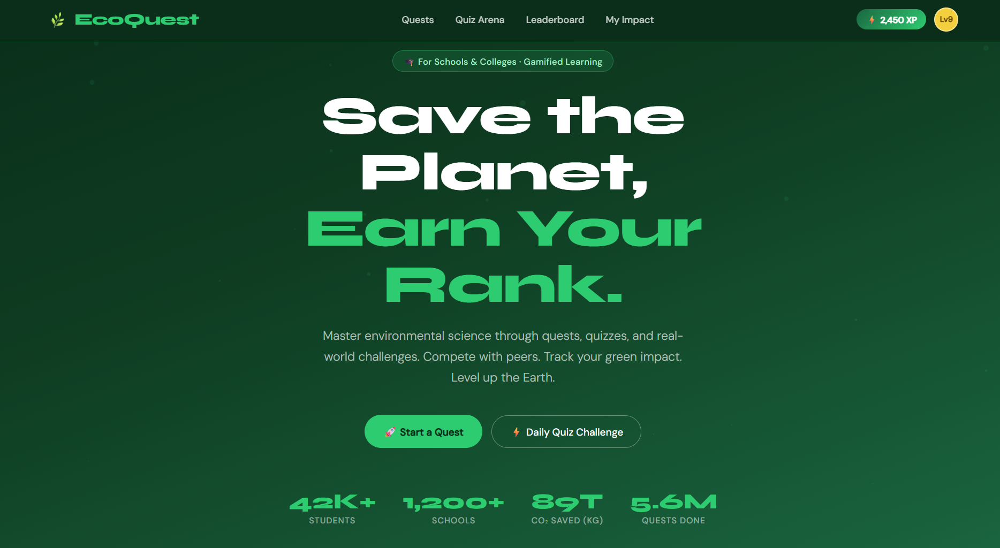
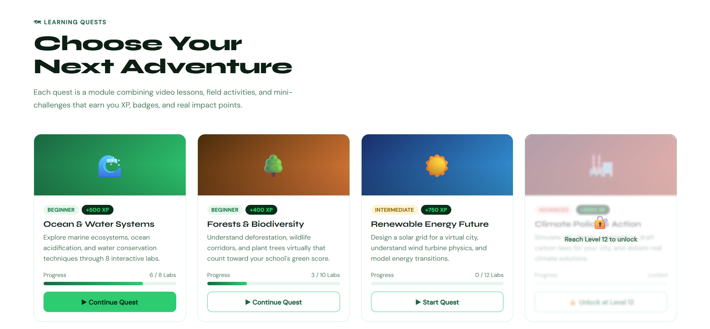
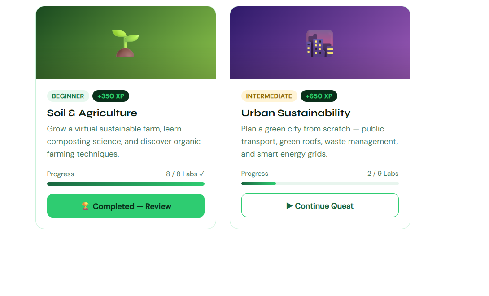
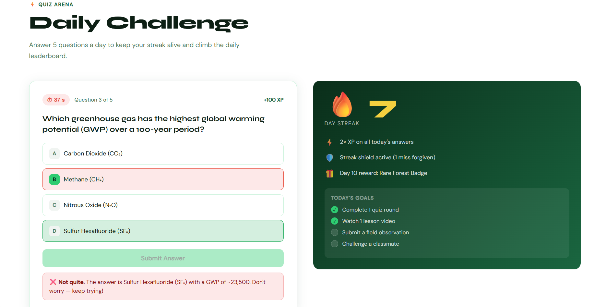
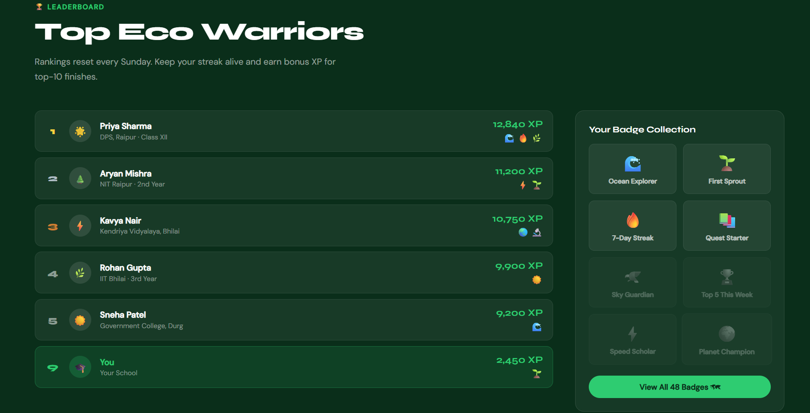
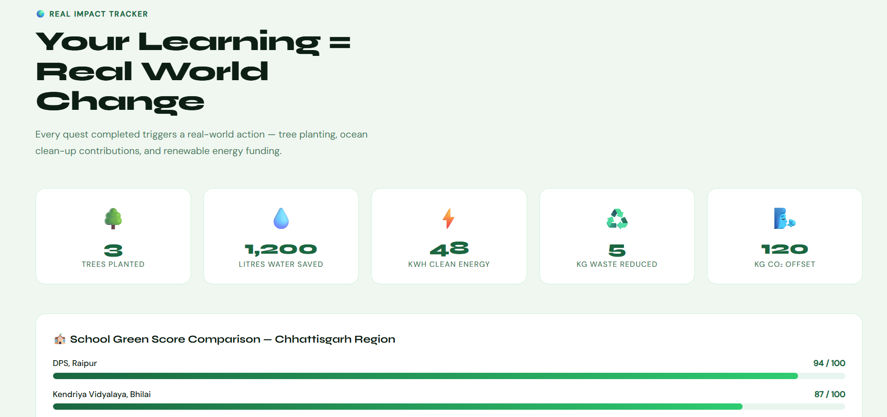
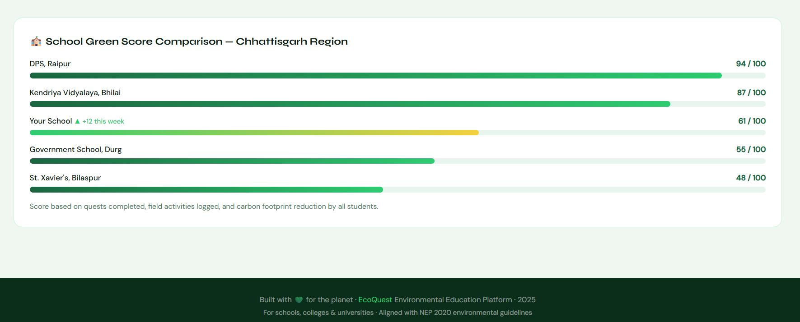

# 🌿 EcoQuest — Environmental Learning Platform

> **Save the Planet, Earn Your Rank.**

A gamified environmental education platform for schools and colleges. Students master environmental science through quests, quizzes, and real-world challenges — competing with peers, tracking their green impact, and leveling up.

---

## 📸 Screenshots

### Hero — Landing Page

*Gamified landing page with XP tracker, level badge, and platform stats (42K+ students, 1,200+ schools)*

### Learning Quests

*Quest cards with difficulty tags, XP rewards, and progress tracking. Locked quests require leveling up.*


*Completed quests show a review option; in-progress quests show lab completion status.*

### Quiz Arena — Daily Challenge

*Timed daily quiz with 5 questions, streak counter, 2× XP bonuses, and daily goal tracking.*

### Leaderboard

*Weekly rankings of top eco warriors with XP scores, badges, and school affiliations. Badge collection panel on the right.*

### Real Impact Tracker

*Personal impact metrics: trees planted, water saved, clean energy generated, waste reduced, and CO₂ offset.*

### School Green Score Comparison

*Regional school leaderboard comparing green scores across Chhattisgarh schools.*

---

## ✨ Features

- **🗺 Learning Quests** — Modular courses combining video lessons, field activities, and mini-challenges across 6 environmental topics
- **⚡ Quiz Arena** — Daily 5-question timed challenges with streak rewards and 2× XP bonuses
- **🏆 Leaderboard** — Weekly rankings with badges, school affiliations, and bonus XP for top-10 finishes
- **🌍 Real Impact Tracker** — Every quest completed triggers real-world actions (tree planting, ocean clean-up, renewable energy funding)
- **🏫 School Green Score** — Regional school comparison based on quests, field activities, and carbon footprint reduction
- **🎖 Badge Collection** — 48 unlockable achievement badges
- **📈 XP & Leveling System** — Earn XP through quests and quizzes; unlock advanced content at higher levels

---

## 🗺 Quest Modules

| Quest | Difficulty | XP | Labs |
|-------|-----------|-----|------|
| 🌊 Ocean & Water Systems | Beginner | +500 XP | 8 |
| 🌳 Forests & Biodiversity | Beginner | +400 XP | 10 |
| ☀️ Renewable Energy Future | Intermediate | +750 XP | 12 |
| 🏭 Climate Policy & Action | Advanced | +1000 XP | — |
| 🌱 Soil & Agriculture | Beginner | +350 XP | 8 |
| 🌆 Urban Sustainability | Intermediate | +650 XP | 9 |

---

## 🛠 Tech Stack

- **Frontend:** Vanilla HTML5, CSS3, JavaScript (ES6+)
- **Fonts:** [Syne](https://fonts.google.com/specimen/Syne) (headings) + [DM Sans](https://fonts.google.com/specimen/DM+Sans) (body) via Google Fonts
- **Animations:** CSS keyframes, Intersection Observer API for scroll-triggered fade-ins
- **No build tools / No frameworks** — single-file HTML, zero dependencies

---

## 🚀 Getting Started

```bash
# Clone the repository
git clone https://github.com/your-username/ecoquest.git

# Navigate to the project
cd ecoquest

# Open in browser (no build step required)
open index.html
```

Or simply open `index.html` directly in any modern browser.

---

## 📁 Project Structure

```
ecoquest/
├── index.html          # Main application (single-file)
├── screenshots/        # UI screenshots
│   ├── hero.png
│   ├── quests-1.png
│   ├── quests-2.png
│   ├── quiz.png
│   ├── leaderboard.png
│   ├── impact.png
│   └── school-comparison.png
└── README.md
```

---

## 🌱 Alignment

- Aligned with **NEP 2020** environmental education guidelines
- Designed for schools, colleges, and universities across India
- Regional leaderboards for Chhattisgarh, with national expansion planned

---

## 📊 Platform Stats

| Metric | Value |
|--------|-------|
| Students | 42,000+ |
| Schools | 1,200+ |
| CO₂ Saved | 89 tonnes |
| Quests Completed | 5.6 million |

---

## 📄 License

Built with 💚 for the planet · EcoQuest Environmental Education Platform · 2025

---

*For schools, colleges & universities · Aligned with NEP 2020 environmental guidelines*
